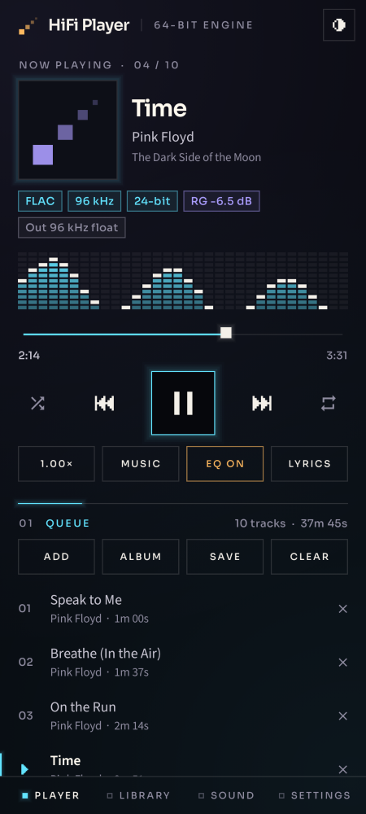
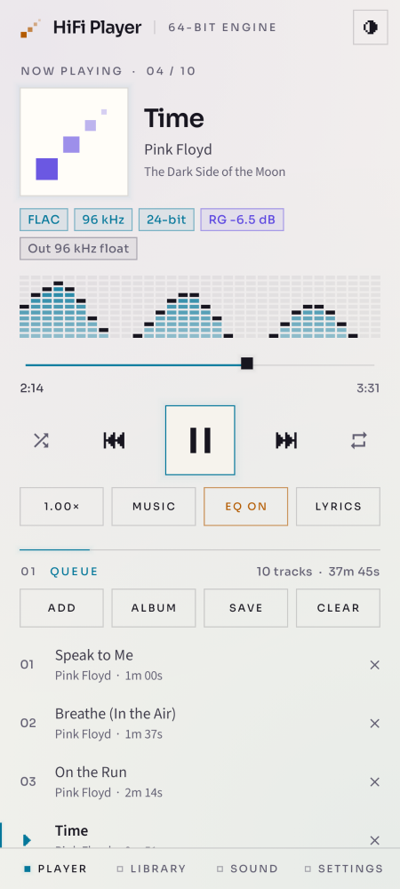
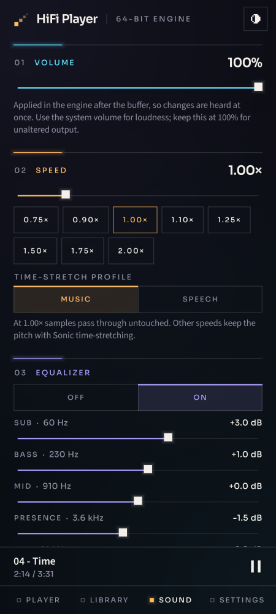
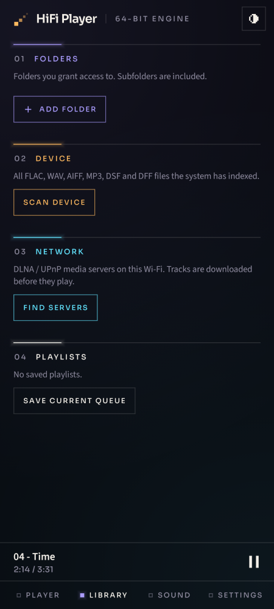

# HiFi Player — собственный 64-битный аудиодвижок для Android

[English](README.md) · **Русский**

Плеер музыки и аудиокниг для Android, построенный вокруг собственного движка
воспроизведения на C++: декодеры, 64-битная обработка, дециматор DSD → PCM,
gapless-переходы и выходной каскад на Oboe. Поверх — приложение на Kotlin и
Jetpack Compose.

<p>
  
  
  
  
</p>

## Что делает движок

| | |
|---|---|
| **Форматы** | FLAC, WAV / RF64 / W64, AIFF / AIFC, MP3, DSF и DSDIFF (DSD64 – DSD512), WavPack, Monkey's Audio (APE), TTA, Ogg Vorbis, Ogg Opus — собственные декодеры, lossless без потерь до бита. AAC / HE-AAC (M4A, M4B), ALAC и другое — через MediaCodec телефона. CUE-файлы (один файл на альбом) играют как отдельные треки без пауз. |
| **Точность** | Декодирование, эквалайзер, ReplayGain и дециматор DSD работают в `double`. Целочисленный PCM до 32 бит и 64-битный float WAV входят в тракт без потерь. Устройство получает 32-битный float. |
| **DSD** | Двухступенчатая FIR-децимация с линейной фазой до 88.2 / 96 кГц: ровно до 24 кГц, наложение спектра подавлено на 110 дБ, единичное усиление. |
| **Gapless** | Следующий трек открывается заранее; треки одного формата стыкуются с точностью до сэмпла, при смене формата поток переоткрывается после доигрывания очереди. |
| **Транспорт** | Пауза и продолжение останавливают и возобновляют потребление на точном кадре — без повторной перемотки и потери сэмплов. Громкость и затухания работают после буфера и слышны сразу. |
| **Скорость** | 0.75× – 2.0× с сохранением высоты тона (Sonic, переведённый на float). Ровно на 1.00× сэмплы проходят без изменений. |
| **Громкость** | ReplayGain (трек / альбом) из Vorbis comments, R128 в Opus, ID3v2, APEv2 и тегов MP4 с ограничением по пику из тега. Файлы без тегов измеряются (EBU R128, истинный пик) в фоне и выравниваются так же. Лимитер истинного пика держит межсэмпловые пики ниже −1 dBTP (ниже этого — без изменений до бита). |
| **EQ и кроссфид** | Параметрический эквалайзер до 20 фильтров, графический режим на 5 полос, профили наушников AutoEQ (поиск прямо в приложении, ~9000 моделей) или любой файл Equalizer APO; запас по реальному пику АЧХ. Кроссфид bs2b для наушников (три пресета). |
| **Надёжность** | Смена устройства (Bluetooth, USB, наушники) переоткрывает поток в том же формате; неподдерживаемая многоканальность сводится в стерео; если устройство отказывает в частоте, Oboe передискретизирует. |

Измерено нативными тестами (`tests/native`) на компьютере:

- DSD64, тон 1 кГц: ошибка усиления 0.0000 дБ; SNR в звуковой полосе равен SNR самого тестового модулятора (71.8 против 71.7 дБ) — дециматор не добавляет измеримого шума.
- DSD64, тон 70 кГц: продукт наложения на 18.2 кГц на 110 дБ ниже входа.
- Растяжение 1.25×, тон −66 dBFS: SNR 149.5 дБ (у исходного 16-битного Sonic — 31 дБ).
- MP3 длиной 10 минут: 20 перемоток в конец файла — около 18 мс суммарно (таблица перемотки строится при открытии).

Подробности: [docs/AUDIO_ENGINE.md](docs/AUDIO_ENGINE.md) (на английском).

## Приложение

- **Плеер** — обложка, название, исполнитель и альбом, метки формата (кодек, частота, разрядность, DSD, ReplayGain, выход), «пиксельный» спектр того, что реально звучит, транспорт, перемешивание и повтор, очередь.
- **Медиатека** — **альбомы** (сетка обложек) и **исполнители** по тегам ваших папок, поиск; **источники**: папки через Storage Access Framework (с браузером папок и CUE), сканирование устройства (MediaStore), DLNA / UPnP-серверы с навигацией по папкам (FLAC, WAV, WavPack и TTA начинают играть, пока скачиваются), сохранённые плейлисты.
- **Звук** — громкость, скорость и профиль растяжения, эквалайзер (5 полос или параметрический с AutoEQ), кроссфид, режим ReplayGain, измерение громкости, лимитер истинного пика.
- **DLNA-рендерер** — по желанию телефон виден в сети Wi-Fi как плеер (UPnP MediaRenderer): BubbleUPnP, foobar2000, «Передать на устройство» в Windows или Kodi могут отправлять на него музыку, с gapless-переходом, перемоткой, громкостью и событиями состояния.
- **Настройки** — тема (системная / тёмная / светлая), режим *Музыка* или *Книги* (книги хранят закладку для каждого файла и отмечают прослушанные главы), таймер сна с плавным затуханием за 30 секунд, тракт сигнала от файла до устройства.

Воспроизведение живёт в foreground-службе с media session: уведомление,
экран блокировки, кнопки гарнитуры и Bluetooth, аудиофокус и отключение
наушников работают без интерфейса; обложка видна на экране блокировки и в
уведомлении. **Android Auto** показывает очередь, альбомы (с обложками),
исполнителей, плейлисты и папки и понимает голосовой поиск («включи … в HiFi Player»). Визуальный стиль повторяет
[airwitech.com](https://airwitech.com): цвета «чернила» и «бумага», фиолетовый /
янтарный / голубой акценты, шрифты Sora и Source Sans 3, прямые углы, тонкие
линии и пиксельные знаки.

## Сборка

Нужны JDK 17 или 21, Android SDK 35, NDK 28.2.13676358, CMake 3.22.1.

```bash
./gradlew assembleDebug
```

APK: `app/build/outputs/apk/debug/app-debug.apk`. Подпись release-сборки,
вариант `audit` (ставится рядом с основным) и детали окружения —
в [docs/BUILDING.md](docs/BUILDING.md).

## Тесты

```bash
bash tests/native/run.sh                 # движок: ASan + UBSan, реальные файлы всех форматов
TSAN=1 bash tests/native/run.sh          # плюс ThreadSanitizer для сценариев плеера
./gradlew testDebugUnitTest lintDebug    # JVM-тесты и Android lint
```

Нативным тестам нужен только компилятор C/C++17 (SoX, FLAC и LAME включают
тесты на настоящих файлах). См. [docs/TESTING.md](docs/TESTING.md), там же —
чек-лист проверки на телефоне.

## Честные ограничения

В общем режиме Android смешивает звук всех приложений, поэтому система может
передискретизировать сигнал и применять свою громкость; плеер не заявляет
bit-perfect вывод. DSD преобразуется в PCM (без DoP). Как будет сделан настоящий
bit-perfect вывод на USB-ЦАП — в [docs/DIRECT_OUTPUT_PLAN.md](docs/DIRECT_OUTPUT_PLAN.md)
(на английском); остальные ограничения — в [docs/ROADMAP.md](docs/ROADMAP.md).

## Лицензия

MIT — см. [LICENSE](LICENSE). Сторонние компоненты распространяются по своим
лицензиям ([THIRD_PARTY_NOTICES.md](THIRD_PARTY_NOTICES.md)).
